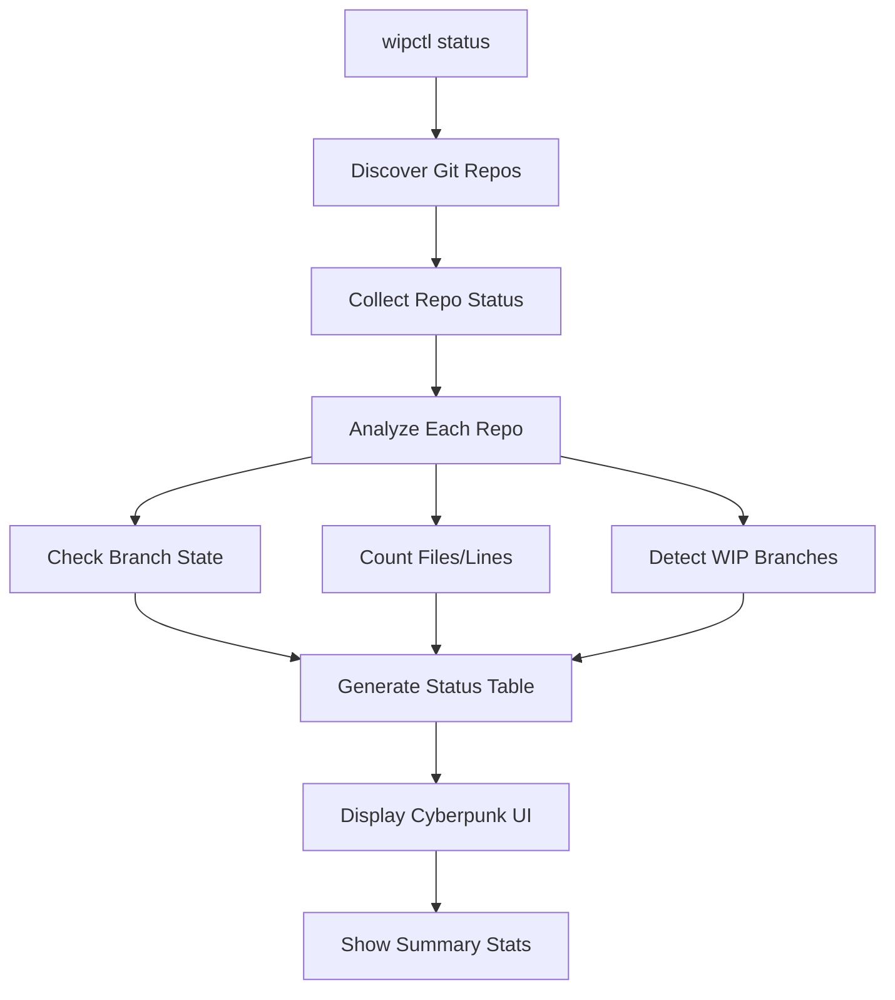
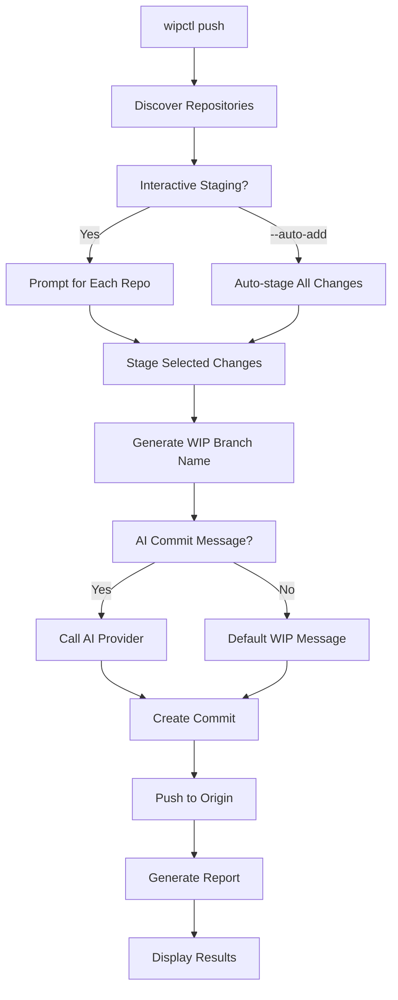
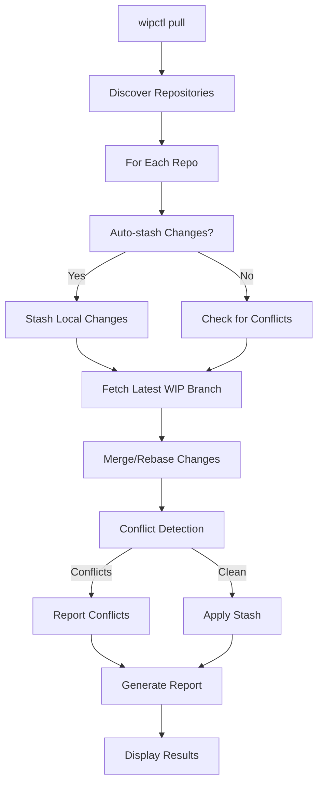
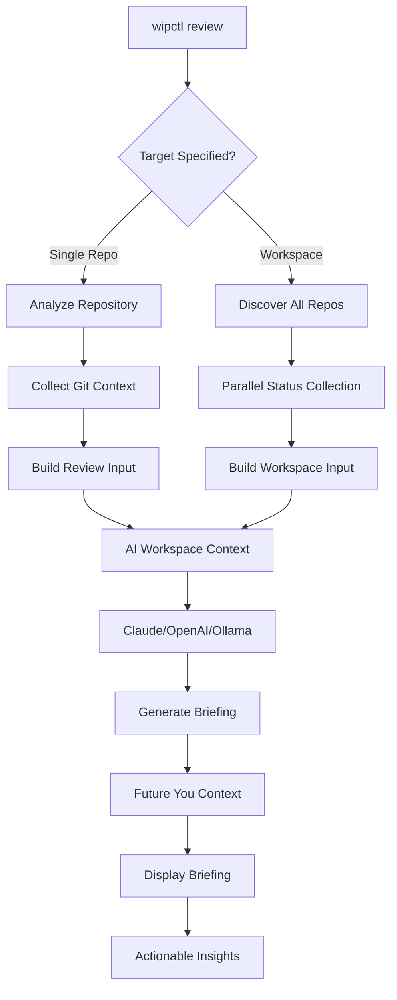
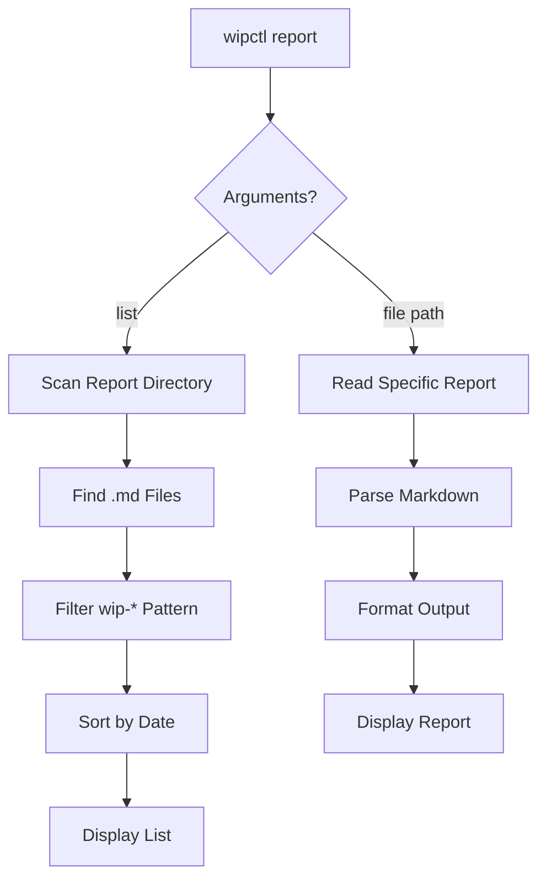
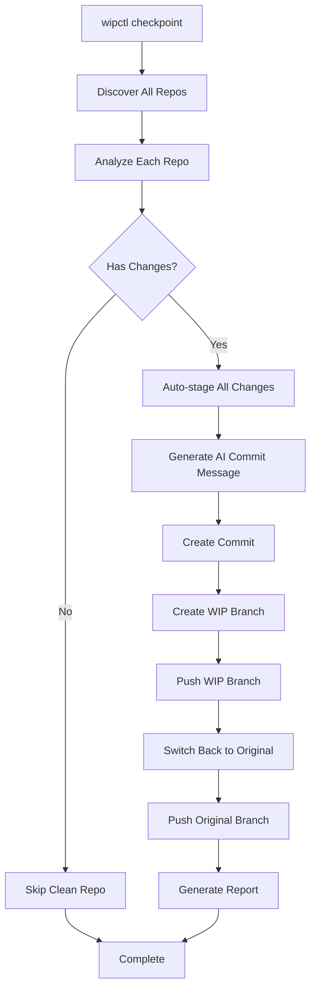
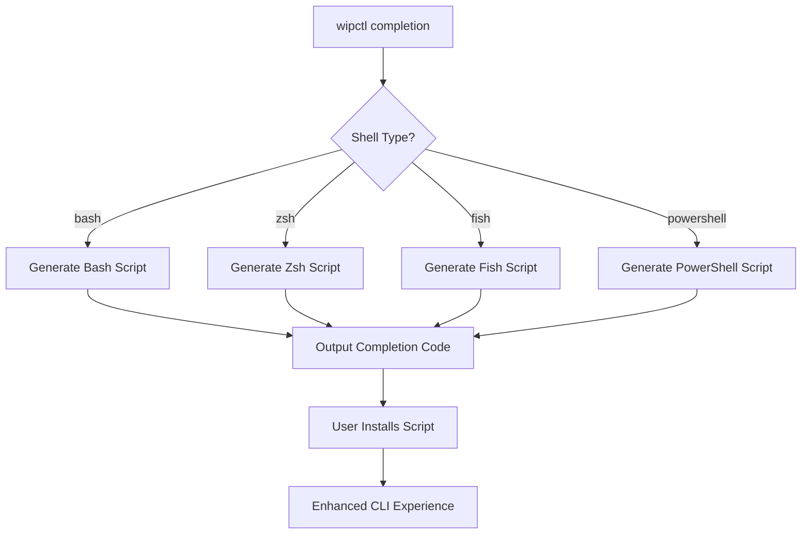

# 🚀 wipctl - Workspace Intelligence Platform

Fast, safe, interactive CLI to synchronize many Git repos across machines using timestamped WIP branches with AI-generated commit messages and workspace intelligence.

## ✨ Features

- 🔄 **Multi-repo synchronization** with timestamped WIP branches
- 🤖 **AI-powered commit messages** via pluggable providers (Claude, OpenAI, Ollama)
- 📊 **Workspace intelligence** with context briefings for "future you"
- 🛡️ **Safe operations** with dry-run mode and conflict detection
- ⚡ **Parallel processing** with concurrency limits
- 🎨 **Cyberpunk terminal UI** with professional synthwave theming
- 📋 **Comprehensive reporting** with markdown outputs

## 🎯 Commands Overview

### Status Command Flow


### Push Command Flow


### Pull Command Flow


### Review Command Flow (Workspace Intelligence)


### Report Command Flow


### Checkpoint Command Flow (🚀 Hackerspeed)


### Completion Command Flow


## 🔧 Installation & Setup

### Build from Source
```bash
# Build all CLI tools
task build

# Set permissions
task permissions

# Deploy to system PATH
task deploy
```

### Shell Completion Setup
```bash
# For Zsh (recommended)
wipctl completion zsh > ~/.zsh/completions/_wipctl
echo 'fpath=(~/.zsh/completions $fpath)' >> ~/.zshrc
echo 'autoload -U compinit && compinit' >> ~/.zshrc

# For Bash
wipctl completion bash > /etc/bash_completion.d/wipctl
# Or for user-specific:
wipctl completion bash > ~/.bash_completions/wipctl
echo 'source ~/.bash_completions/wipctl' >> ~/.bashrc

# For Fish
wipctl completion fish > ~/.config/fish/completions/wipctl.fish
```

## 🤖 AI Provider Configuration

Configure AI providers via environment variables:

```bash
# Claude (Anthropic) - Recommended
export WIPCTL_AI_PROVIDER="claude"
export WIPCTL_AI_TOKEN="sk-ant-api03-..."
export WIPCTL_AI_MODEL="claude-3-haiku-20240307"

# OpenAI
export WIPCTL_AI_PROVIDER="openai"
export WIPCTL_AI_TOKEN="sk-..."
export WIPCTL_AI_MODEL="gpt-3.5-turbo"
export WIPCTL_AI_ENDPOINT="https://api.openai.com"

# Ollama (Local)
export WIPCTL_AI_PROVIDER="ollama"
export WIPCTL_AI_ENDPOINT="http://localhost:11434"
export WIPCTL_AI_MODEL="llama2"

# External Command
export WIPCTL_AI_PROVIDER="exec"
export WIPCTL_AI_EXEC="/path/to/custom/ai/script"

# Optional Settings
export WIPCTL_AI_MAX_TOKENS="256"
export WIPCTL_AI_TEMPERATURE="0.1"
```

## 📚 Command Reference

### Global Flags
- `--dry-run` - Show what would be done without making changes
- `--workspace, -w` - Workspace directory to search for Git repos (default: ".")
- `--host` - Host identifier for WIP branches (default: hostname)
- `--report-dir` - Directory for reports (default: `<workspace>/.wipctl`)

### Commands

#### `wipctl status`
Show status of all Git repositories in the workspace with cyberpunk-themed table display.

**Features:**
- Repository name and current branch
- Dirty and untracked file counts
- Commits ahead/behind origin
- Lines added/removed statistics
- WIP branch detection
- Precondition validation

#### `wipctl push [--auto-add]`
Create WIP branches and push to origin with optional AI-generated commits.

**Process:**
1. Validates preconditions (has origin, not mid-rebase/merge)
2. Interactive staging prompts (or `--auto-add` for automation)
3. AI-generated commit messages (optional)
4. Creates timestamped WIP branch (`wip/<host>/<timestamp>`)
5. Commits and pushes WIP branch
6. Updates current branch if it exists on origin

#### `wipctl pull`
Pull latest WIP branches from origin across all repositories with safe conflict handling.

**Safety Features:**
- Auto-stashing of local changes
- Conflict detection and reporting
- Non-destructive merge strategies
- Detailed conflict resolution guidance

#### `wipctl review [repository-path]`
AI-powered workspace context briefing for future work sessions.

**Intelligence Features:**
- **Workspace Analysis**: Cross-repository pattern detection
- **Work Session Summary**: What you were working on when you stopped
- **Active Project Detection**: Repositories with ongoing changes
- **Priority Guidance**: Where to start when returning to work
- **Context Continuity**: Maintains development flow across sessions

**Usage:**
- No args: Analyze entire workspace
- With path: Analyze specific repository

#### `wipctl report [list|file-path]`
List and display wipctl operation reports with comprehensive markdown formatting.

**Report Types:**
- `wip-push-*`: Push operation results
- `wip-pull-*`: Pull operation results
- `wip-review-*`: Workspace context briefings

#### `wipctl checkpoint [--message="prefix"]`
🚀 **Hackerspeed checkpoint** - analyze, commit, and push all repositories with changes.

**Process:**
1. Discovers all repositories in workspace
2. Analyzes each repo for changes (dirty/untracked files or commits ahead)
3. Auto-stages ALL changes (no prompts for maximum speed)
4. Generates AI-powered commit messages
5. Creates timestamped WIP branch (`wip/<host>/<timestamp>`)
6. Pushes WIP branch to origin
7. Returns to original branch and pushes if needed

**Perfect for:**
- End-of-day rapid checkpoints
- Pre-meeting code snapshots
- Quick backup before risky changes
- Continuous development flow

**Flags:**
- `--message="EOD"` - Custom message prefix for commits
- `--concurrency=8` - Parallel operations limit
- `--dry-run` - Preview operations without executing

#### `wipctl completion [bash|zsh|fish|powershell]`
Generate shell completion scripts for enhanced CLI experience.

**Features:**
- Command completion
- Flag completion
- File path completion
- Contextual suggestions

## 🎨 UI Features

### Cyberpunk Terminal Theme
- **Synthwave color palette** with professional aesthetics
- **ASCII art banners** for visual command identification
- **Status indicators** with emoji and color coding
- **Progress bars** for long-running operations
- **Responsive tables** that adapt to terminal size

### Intelligence Features
- **Workspace context briefing** - AI-powered "future you" guidance
- **Multi-repo analysis** - Cross-repository pattern detection
- **Active work detection** - Identifies repos with ongoing changes
- **Priority guidance** - Suggests where to start next
- **Work session continuity** - Maintains context across development sessions

## 📊 Example Workflows

### Daily Development Cycle
```bash
# Morning: Check workspace status and context
wipctl status
wipctl review

# Work on code throughout the day...

# Quick hackerspeed checkpoint during development
wipctl checkpoint --message="midday-backup"

# Evening: Final checkpoint with comprehensive sync
wipctl checkpoint --message="EOD"

# Generate and review session reports
wipctl report list
```

### Multi-Machine Synchronization
```bash
# Machine 1: Hackerspeed checkpoint all work
wipctl checkpoint

# Machine 2: Pull latest changes
wipctl pull

# Review context for seamless continuation
wipctl review
```

### Team Collaboration & Handoffs
```bash
# Generate comprehensive workspace briefing
wipctl review > project-context-$(date +%Y%m%d).md

# Share context with team members
# Enables instant project state understanding
```

### CI/CD Integration
```bash
#!/bin/bash
# Pre-deploy hackerspeed sync
wipctl status --dry-run
if [ $? -eq 0 ]; then
    wipctl checkpoint --message="pre-deploy"
    wipctl report | tail -5
fi
```

### Rapid Development Workflow
```bash
# Ultimate hackerspeed development cycle
alias quicksave="wipctl checkpoint --message='quicksave'"
alias eod="wipctl checkpoint --message='EOD' && wipctl review"

# During development - instant checkpoint
quicksave

# End of day - checkpoint + context briefing
eod
```

## 🛡️ Safety Features

### Precondition Validation
- **Origin remote check** - Ensures repositories have upstream
- **Operation state check** - Detects ongoing rebase/merge operations
- **Git repository validation** - Confirms valid Git structure

### Junk File Protection
Automatically skips repositories with untracked files matching:
- `node_modules`, `.venv`, `venv`, `dist`, `build`
- `.tox`, `.ruff_cache`, `.mypy_cache`, `.pytest_cache`
- `.DS_Store`, `coverage`, `.cache`

### Conflict Resolution
- **Auto-stashing** - Preserves local changes during operations
- **Conflict detection** - Identifies merge conflicts automatically
- **Non-destructive handling** - Never force-pushes or overwrites
- **Resolution guidance** - Provides clear next steps

### Dry-Run Mode
- **Risk-free testing** - Preview all operations before execution
- **Complete simulation** - Shows exactly what would happen
- **Safe experimentation** - Test complex workflows safely

## 📈 Performance Optimizations

- **Parallel processing** with configurable concurrency limits
- **Efficient git operations** using native git commands
- **Smart caching** for repository discovery and status
- **Optimized status collection** across large workspaces
- **Responsive UI** even with 100+ repositories
- **Memory efficient** streaming of git output

## 🔍 Troubleshooting

### Common Issues

#### "no origin remote"
```bash
cd repository
git remote add origin git@github.com:user/repo.git
```

#### "rebase/merge in progress"
```bash
cd repository
git rebase --abort  # or --continue
git merge --abort   # or --continue
```

#### "junk guard activated"
```bash
cd repository
echo "node_modules/" >> .gitignore
git add .gitignore && git commit -m "ignore artifacts"
```

#### AI provider errors
- **Claude**: Verify API token and endpoint
- **Ollama**: Check if server is running (`ollama serve`)
- **OpenAI**: Confirm endpoint URL and token validity
- **exec**: Ensure script is executable and in PATH

### Debug Mode
```bash
# Enable verbose logging
export WIPCTL_DEBUG=1
wipctl status

# Dry-run for safe testing
wipctl push --dry-run --auto-add
```

---

**wipctl** - *Workspace Intelligence Platform for the Modern Developer* 🚀

*Fast • Safe • Intelligent • Beautiful*